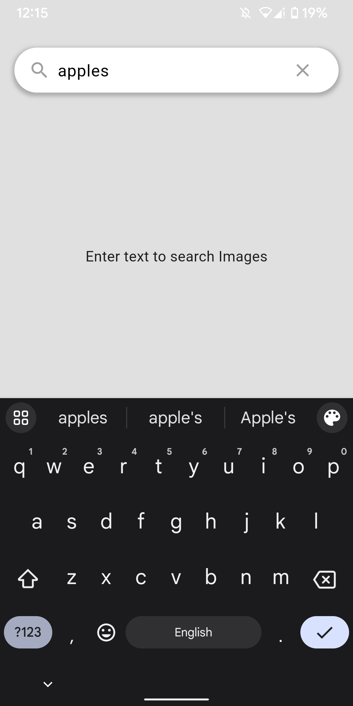

# Imagify

A Flutter app to search and download images using the Unsplash API.

## Features

- Search for images by keywords.
- View search results in a grid layout.
- Download images to your device.

## Getting Started

### Screenshots

  

    
    
<strong>Screenshot 1</strong>

  

  

    
    
<strong>Screenshot 2</strong>

  

  

    
    
<strong>Screenshot 3</strong>

  

 

---

 

  

    
    
<strong>Screenshot 4</strong>

  

  

    
    
<strong>Screenshot 5</strong>

  

  

    
    
<strong>Screenshot 6</strong>

  

